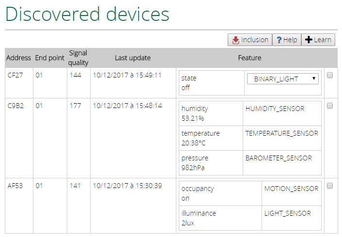
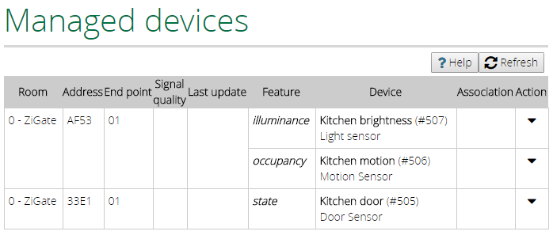

#  Vera-Plugin-ZiGateGateway

**Control your ZigBee devices from your Vera**

<br/>

Designed for [Vera Control, Ltd.](http://getvera.com) Home Controllers (UI7) and [openLuup](https://github.com/akbooer/openLuup).


## Introduction

This plugin is a gateway to [ZiGate](http://zigate.fr), and brings compatibility with the ZigBee network.

The plugin creates new devices (switches, dimmers, sensors, ...) in your Vera corresponding to your ZigBee network.
These devices appear in the User Interface as the others (e.g. Z-wave devices) and can be used in scenes.

For specific manipulations (settings, association), the plugin has its own User Interface.


## Requirements

Plug the ZiGate USB dongle into an Vera's USB port.


## Installation on legacy Vera

#### Get the plugin

- Mios Marketplace

  This plugin is not available on the Mios Marketplace for the moment. This could change if Vera Control, Ltd. makes it more "developper friendly".

- Alternate App Store on ALTUI

- [Github repository](https://github.com/vosmont/Vera-Plugin-ZiGateGateway)
  
  Upload the files in "luup files" in the Vera (by the standard UI in "Apps-->Develop Apps-->Luup files").
  
  Create a new device in "Apps-->Develop Apps-->Create device", and set "Upnp Device Filename" to "D_ZiGateGateway1.xml".

#### Set the serial connection

Assign the serial port of the dongle to the plugin : go to "Apps/Develop Apps/Serial Port Configuration" and select from "Used by device" drop down list the "ZiGate Gateway".
Set the following parameters :

```
Baud Rate : 115200
Data bits : 8
Parity    : none
Stop bits : 1
```

## Installation on openLuup

#### Get the plugin
- Alternate App Store on ALTUI

- Github repository

#### Install dependencies

```
sudo luarocks install luabitop
```

#### Set the serial connection

1. Retrieve the usb device

With the command "dmesg", you will find the mounted point.
```
[    7.151351] usbcore: registered new interface driver usbserial
[    7.151525] usbcore: registered new interface driver usbserial_generic
[    7.151663] usbserial: USB Serial support registered for generic
[    7.230878] usbcore: registered new interface driver pl2303
[    7.231047] usbserial: USB Serial support registered for pl2303
[    7.231167] pl2303 1-1.3:1.0: pl2303 converter detected
[    7.323296] usb 1-1.3: pl2303 converter now attached to ttyUSB0
```
In this example, the USB device is reachable on /dev/ttyUSB0

2. Install Serial to Network Proxy

Install ser2net
```
sudo apt-get update
sudo apt-get install ser2net
```

3. Configuration

Edit the file "ser2net.conf"
```
sudo nano /etc/ser2net.conf
```
Add this line (it depends on your device)
```
3481:raw:0:/dev/ttyUSB0:115200 8DATABITS NONE 1STOPBIT
```

4. Restart the deamon
```
sudo /etc/init.d/ser2net restart
```

5. Declare the serial connection

Set the attribut "ip" to "127.0.0.1:3481", on the plugin instance.


## Add your ZigBee devices

1. In the "Discovered devices" tab, click on the button "Inclusion" (this mode will be activated during 30 seconds).
2. Associate your ZigBee devices with the ZiGate (usually by physically pressing a button on your device)
3. The ZigBee devices should appear in the tab.

4. Select the devices you want to create on your Vera, by selecting them and choosing the device type if needed.

## ZigBee devices

The ZigBee devices, known by the ZiGate and learned by the Vera, behave themselves as standard devices on the Vera.

You will find all the learned ZigBee devices in the "Managed devices" tab.


## Device settings

1. In the "Managed devices" tab, click on the button "Action" of the ZigBee device.

2. You can change the behavior of your device (e.g., change the timeout of a motion sensor).

## Association

You can define a link between your ZigBee device and another device in your Vera. It allows you to bind devices without having to use scenes.

From the tab "Devices" in the plugin, click on the action "Associate" of the device you wish to link.
Then select the compatible devices and validate.

Association means that changes on the ZigBee device will be passed on the associated device (e.g. if the ZigBee device is switched on, the associated device is switched on too).


## Logs

You can control your rules execution in the logs. Just set the variable "DebugMode" to 1.

- on legacy Vera (ssh terminal):
```
tail -f /var/log/cmh/LuaUPnP.log | grep "^01\|ZiGateGateway"
```

- on legacy Vera (http):
```
 http://vera_ip/cgi-bin/cmh/log.sh?Device=LuaUPnP
```

- on openLuup (ssh terminal):
```
tail -F {openLuup folder}/cmh-ludl/logs/LuaUPnP.log | grep "ERROR\|ZiGateGateway"
```
